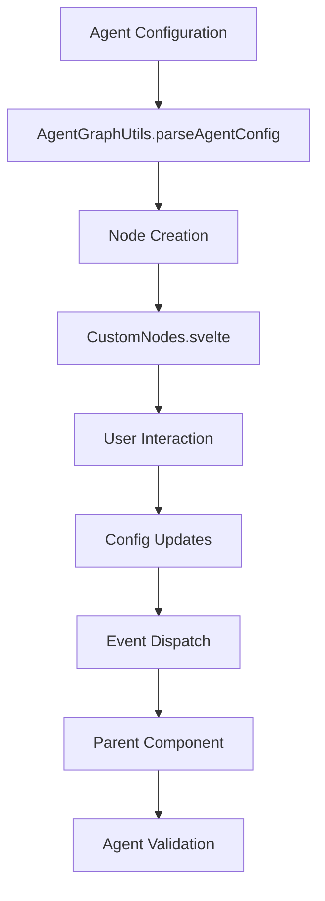

# Custom Nodes Documentation

## Overview

Custom Nodes are the core building blocks of the agent workflow visualization system. They provide an interactive, configurable interface for defining agent behavior within the visual graph editor. Each custom node represents a specific step or component in an agent's workflow, with configurable properties and visual connections.

## Architecture

### Core Components

```
CustomNodes System:
├── CustomNodes.svelte          # Main custom node component
├── AgentGraphUtils.ts          # Node parsing and graph utilities
├── AgentGraphModal.svelte      # Graph container and management
└── Node Types:
    ├── LLMToolNode             # Language model tool nodes
    ├── ToolNode                # General tool execution nodes
    ├── SubGraphNode            # Nested workflow nodes
    ├── StartNode               # Workflow entry points
    └── EndNode                 # Workflow exit points
```

### Data Flow



## CustomNodes.svelte Component

### Component Structure

```typescript
interface NodeProps {
  id: string;
  data: NodeData;
  isConnectable: boolean;
}

interface NodeData {
  label: string;
  config?: Record<string, any>;
  type?: string;
  position?: { x: number; y: number };
}
```

### Key Features

1. **Dynamic Configuration**: Automatically generates input fields based on node configuration
2. **Real-time Updates**: Immediate propagation of changes to parent components
3. **Validation Integration**: Built-in support for required field validation
4. **Visual Connections**: Handle components for graph edge connections
5. **Responsive Design**: Adapts to different node types and configurations

### Implementation Details

```svelte
<script lang="ts">
  import { Handle, Position, type NodeProps } from "@xyflow/svelte";
  import { onMount, createEventDispatcher } from "svelte";

  let { id, data, isConnectable }: NodeProps = $props();
  let configKeys: string[] = [];
  let configValues: any = {};
  const dispatch = createEventDispatcher();

  // Required fields for node config
  const requiredFields = ["tools", "prompt", "output"];

  onMount(() => {
    if (data && data.config) {
      configKeys = Array.from(new Set([
        ...Object.keys(data.config), 
        ...requiredFields
      ]));
      
      configValues = {
        ...requiredFields.reduce((acc, key) => ({
          ...acc, 
          [key]: data.config?.[key] ?? ""
        }), {}),
        ...data.config
      };
    }
  });

  function handleFieldChange(key: string, value: string) {
    configValues = { ...configValues, [key]: value };
    if (data && data.config) {
      data.config[key] = value;
    }
    dispatch("update", { id, config: configValues });
  }
</script>
```

### Configuration System

#### Required Fields

All custom nodes enforce these required configuration fields:

| Field | Type | Description | Example |
|-------|------|-------------|---------|
| `tools` | string/array | Tools available to the node | `["search_tool", "analysis_tool"]` |
| `prompt` | string | Instructions for the node | `"Analyze the user query and extract key information"` |
| `output` | string | Output format specification | `"structured_json"` |

#### Dynamic Fields

Custom nodes automatically detect and display additional configuration fields:

```typescript
// Example node configuration
const nodeConfig = {
  // Required fields
  tools: ["healthcare_search", "provider_lookup"],
  prompt: "Find healthcare providers based on user criteria",
  output: "provider_list",
  
  // Dynamic fields (auto-detected)
  max_results: "10",
  search_radius: "25 miles",
  insurance_required: "true",
  specialization_filter: "cardiology"
};
```

#### Field Types and Validation

```typescript
interface FieldValidation {
  required: boolean;
  type: 'string' | 'number' | 'boolean' | 'array' | 'object';
  pattern?: RegExp;
  min?: number;
  max?: number;
  options?: string[];
}

const fieldValidations: Record<string, FieldValidation> = {
  tools: {
    required: true,
    type: 'array',
    min: 1
  },
  prompt: {
    required: true,
    type: 'string',
    min: 10
  },
  max_results: {
    required: false,
    type: 'number',
    min: 1,
    max: 100
  }
};
```

## Node Types

### 1. LLMToolNode

Language Model Tool Nodes represent AI-powered processing steps.

```typescript
interface LLMToolNodeConfig {
  tools: string[];
  prompt: string;
  output: string;
  model?: string;
  temperature?: number;
  max_tokens?: number;
  system_prompt?: string;
}

// Example configuration
const llmNode = {
  id: "llm_analysis",
  type: "llm_tool",
  label: "Symptom Analysis",
  config: {
    tools: ["medical_knowledge", "symptom_checker"],
    prompt: "Analyze patient symptoms and suggest potential conditions",
    output: "condition_list",
    model: "gpt-4",
    temperature: 0.3,
    max_tokens: 500
  }
};
```

**Use Cases:**
- Natural language processing
- Data analysis and interpretation
- Content generation
- Decision making based on complex criteria

### 2. ToolNode

General Tool Nodes represent specific utility functions or external service calls.

```typescript
interface ToolNodeConfig {
  tools: string[];
  prompt: string;
  output: string;
  tool_config?: Record<string, any>;
  retry_attempts?: number;
  timeout?: number;
}

// Example configuration
const toolNode = {
  id: "database_query",
  type: "tool",
  label: "Provider Search",
  config: {
    tools: ["database_search"],
    prompt: "Search for healthcare providers matching criteria",
    output: "provider_results",
    tool_config: {
      database: "healthcare_providers",
      index: "location_specialization"
    },
    retry_attempts: 3,
    timeout: 30000
  }
};
```

**Use Cases:**
- Database queries
- API calls to external services
- File operations
- Data transformations

### 3. SubGraphNode

SubGraph Nodes contain nested workflows, enabling complex, hierarchical agent designs.

```typescript
interface SubGraphNodeConfig {
  tools: string[];
  prompt: string;
  output: string;
  subgraph: {
    nodes: Node[];
    edges: Edge[];
    entry_point?: string;
    exit_point?: string;
  };
}

// Example configuration
const subgraphNode = {
  id: "patient_intake",
  type: "subgraph",
  label: "Patient Intake Process",
  config: {
    tools: ["form_processor", "validation_tool"],
    prompt: "Process patient intake information",
    output: "validated_patient_data",
    subgraph: {
      nodes: [
        { id: "collect_info", type: "tool", label: "Collect Information" },
        { id: "validate_data", type: "llm_tool", label: "Validate Data" },
        { id: "format_output", type: "tool", label: "Format Output" }
      ],
      edges: [
        { from: "collect_info", to: "validate_data" },
        { from: "validate_data", to: "format_output" }
      ],
      entry_point: "collect_info",
      exit_point: "format_output"
    }
  }
};
```

**Features:**
- **Expandable UI**: Can be collapsed/expanded in the visual editor
- **Nested Execution**: Independent workflow execution within parent workflow
- **Data Passing**: Input/output between parent and subgraph
- **Recursive Structure**: Subgraphs can contain other subgraphs

### 4. StartNode & EndNode

Entry and exit points for workflow execution.

```typescript
interface StartNodeConfig {
  tools: string[];
  prompt: string;
  output: string;
  input_schema?: Record<string, any>;
  validation_rules?: string[];
}

interface EndNodeConfig {
  tools: string[];
  prompt: string;
  output: string;
  output_schema?: Record<string, any>;
  success_conditions?: string[];
}
```

## Visual Styling and Theming

### Default Styling

```css
.custom-node {
  background: #fff;
  border: 2px solid #333;
  border-radius: 8px;
  padding: 12px 16px;
  min-width: 220px;
  box-shadow: 0 2px 8px rgba(0,0,0,0.07);
  transition: all 0.2s ease;
}

.custom-node:hover {
  border-color: #007acc;
  box-shadow: 0 4px 12px rgba(0,122,204,0.15);
}

.node-label {
  font-weight: bold;
  font-size: 1.1em;
  margin-bottom: 6px;
  color: #333;
}

.config-section {
  margin-top: 8px;
  font-size: 0.95em;
}

.config-input {
  border: 1px solid #bbb;
  border-radius: 4px;
  padding: 2px 6px;
  font-size: 0.95em;
  margin-left: 2px;
  width: 120px;
  transition: border-color 0.2s ease;
}

.config-input:focus {
  border-color: #007acc;
  outline: none;
  box-shadow: 0 0 0 2px rgba(0,122,204,0.2);
}
```

### Node Type Styling

Different node types can have distinct visual appearances:

```css
/* LLM Tool Nodes */
.custom-node[data-type="llm_tool"] {
  border-color: #4CAF50;
  background: linear-gradient(135deg, #ffffff 0%, #f8fff8 100%);
}

/* Tool Nodes */
.custom-node[data-type="tool"] {
  border-color: #2196F3;
  background: linear-gradient(135deg, #ffffff 0%, #f0f8ff 100%);
}

/* SubGraph Nodes */
.custom-node[data-type="subgraph"] {
  border-color: #FF9800;
  background: linear-gradient(135deg, #ffffff 0%, #fff8f0 100%);
}

/* Start/End Nodes */
.custom-node[data-type="start"] {
  border-color: #9C27B0;
  background: linear-gradient(135deg, #ffffff 0%, #faf0ff 100%);
}

.custom-node[data-type="end"] {
  border-color: #F44336;
  background: linear-gradient(135deg, #ffffff 0%, #fff0f0 100%);
}
```

### Responsive Design

```css
@media (max-width: 768px) {
  .custom-node {
    min-width: 180px;
    padding: 8px 12px;
  }
  
  .config-input {
    width: 100px;
    font-size: 0.9em;
  }
}

@media (max-width: 480px) {
  .custom-node {
    min-width: 150px;
    padding: 6px 10px;
  }
  
  .node-label {
    font-size: 1em;
  }
  
  .config-section {
    font-size: 0.85em;
  }
}
```

## Event System

### Event Types

Custom nodes dispatch various events for parent component communication:

```typescript
interface NodeEvents {
  update: {
    id: string;
    config: Record<string, any>;
  };
  
  validate: {
    id: string;
    errors: ValidationError[];
  };
  
  focus: {
    id: string;
    field?: string;
  };
  
  expand: {
    id: string;
    expanded: boolean;
  };
  
  delete: {
    id: string;
  };
}

// Event handling in parent component
function handleNodeUpdate(event: CustomEvent<NodeEvents['update']>) {
  const { id, config } = event.detail;
  
  // Update agent configuration
  updateAgentNode(id, config);
  
  // Trigger validation
  validateAgentConfiguration();
  
  // Save changes
  saveAgentConfiguration();
}
```

### Event Listeners

```svelte
<CustomNodes 
  {id} 
  {data} 
  {isConnectable}
  on:update={handleNodeUpdate}
  on:validate={handleNodeValidation}
  on:focus={handleNodeFocus}
  on:expand={handleNodeExpansion}
  on:delete={handleNodeDeletion}
/>
```

## Integration with SvelteFlow

### Handle System

Custom nodes use SvelteFlow's Handle system for connections:

```svelte
<!-- Input connection point -->
<Handle 
  type="target" 
  position={Position.Left} 
  {isConnectable}
  style="background: #555"
/>

<!-- Output connection point -->
<Handle 
  type="source" 
  position={Position.Right} 
  {isConnectable}
  style="background: #555"
/>
```

### Multiple Handles

For complex nodes with multiple inputs/outputs:

```svelte
<!-- Multiple input handles -->
{#each inputTypes as inputType, index}
  <Handle 
    type="target" 
    position={Position.Left} 
    id={`input-${inputType}`}
    {isConnectable}
    style={`top: ${20 + index * 25}px; background: #555`}
  />
{/each}

<!-- Multiple output handles -->
{#each outputTypes as outputType, index}
  <Handle 
    type="source" 
    position={Position.Right} 
    id={`output-${outputType}`}
    {isConnectable}
    style={`top: ${20 + index * 25}px; background: #555`}
  />
{/each}
```

### Custom Handle Styling

```css
.custom-handle {
  width: 12px;
  height: 12px;
  border: 2px solid #333;
  border-radius: 50%;
  background: #fff;
}

.custom-handle.source {
  border-color: #4CAF50;
}

.custom-handle.target {
  border-color: #2196F3;
}

.custom-handle:hover {
  transform: scale(1.2);
}
```

## Performance Optimization

### Virtualization

For large graphs with many nodes:

```typescript
import { VirtualizedFlow } from '@xyflow/svelte';

// Only render visible nodes
const visibleNodes = $derived(() => {
  return nodes.filter(node => 
    isNodeInViewport(node.position, viewport)
  );
});
```

### Lazy Loading

```typescript
// Lazy load node configurations
const loadNodeConfig = async (nodeId: string) => {
  if (!nodeConfigs.has(nodeId)) {
    const config = await fetchNodeConfiguration(nodeId);
    nodeConfigs.set(nodeId, config);
  }
  return nodeConfigs.get(nodeId);
};
```

### Debounced Updates

```typescript
import { debounce } from 'lodash-es';

// Debounce configuration updates
const debouncedUpdate = debounce((id: string, config: any) => {
  dispatch('update', { id, config });
}, 300);

function handleFieldChange(key: string, value: string) {
  configValues = { ...configValues, [key]: value };
  debouncedUpdate(id, configValues);
}
```

## Accessibility

### Keyboard Navigation

```svelte
<div 
  class="custom-node"
  tabindex="0"
  role="button"
  aria-label={`${data.label} node configuration`}
  on:keydown={handleKeydown}
>
  <!-- Node content -->
</div>

<script>
function handleKeydown(event: KeyboardEvent) {
  switch (event.key) {
    case 'Enter':
    case ' ':
      // Activate node
      break;
    case 'Delete':
      // Delete node
      dispatch('delete', { id });
      break;
    case 'Escape':
      // Deselect node
      break;
  }
}
</script>
```

### Screen Reader Support

```svelte
<div 
  aria-labelledby="node-label"
  aria-describedby="node-description"
>
  <div id="node-label" class="node-label">{data.label}</div>
  <div id="node-description" class="sr-only">
    Node type: {data.type}. 
    Configuration fields: {configKeys.join(', ')}.
    {requiredFields.length > 0 ? `Required fields: ${requiredFields.join(', ')}` : ''}
  </div>
  
  <!-- Configuration inputs with proper labels -->
  {#each configKeys as key}
    <label for={`${id}-${key}`} class="config-label">
      {key}
      {#if requiredFields.includes(key)}
        <span aria-label="required">*</span>
      {/if}
    </label>
    <input 
      id={`${id}-${key}`}
      class="config-input"
      type="text"
      bind:value={configValues[key]}
      aria-required={requiredFields.includes(key)}
      aria-describedby={requiredFields.includes(key) ? `${id}-${key}-error` : undefined}
    />
  {/each}
</div>
```

## Testing

### Unit Tests

```typescript
// CustomNodes.test.ts
import { render, fireEvent, screen } from '@testing-library/svelte';
import CustomNodes from './CustomNodes.svelte';

describe('CustomNodes', () => {
  const mockNodeData = {
    label: 'Test Node',
    config: {
      tools: ['test_tool'],
      prompt: 'Test prompt',
      output: 'test_output',
      custom_field: 'custom_value'
    }
  };

  it('should render node with configuration fields', () => {
    render(CustomNodes, {
      props: {
        id: 'test-node',
        data: mockNodeData,
        isConnectable: true
      }
    });

    expect(screen.getByText('Test Node')).toBeInTheDocument();
    expect(screen.getByDisplayValue('test_tool')).toBeInTheDocument();
    expect(screen.getByDisplayValue('Test prompt')).toBeInTheDocument();
  });

  it('should handle field changes', async () => {
    const { component } = render(CustomNodes, {
      props: {
        id: 'test-node',
        data: mockNodeData,
        isConnectable: true
      }
    });

    const updateSpy = vi.fn();
    component.$on('update', updateSpy);

    const toolsInput = screen.getByDisplayValue('test_tool');
    await fireEvent.input(toolsInput, { target: { value: 'updated_tool' } });

    expect(updateSpy).toHaveBeenCalledWith(
      expect.objectContaining({
        detail: {
          id: 'test-node',
          config: expect.objectContaining({
            tools: 'updated_tool'
          })
        }
      })
    );
  });

  it('should show required field indicators', () => {
    render(CustomNodes, {
      props: {
        id: 'test-node',
        data: { label: 'Test', config: {} },
        isConnectable: true
      }
    });

    expect(screen.getByPlaceholderText('Required: tools')).toBeInTheDocument();
    expect(screen.getByPlaceholderText('Required: prompt')).toBeInTheDocument();
    expect(screen.getByPlaceholderText('Required: output')).toBeInTheDocument();
  });
});
```

### Integration Tests

```typescript
// Node integration with graph
describe('CustomNodes Integration', () => {
  it('should integrate with SvelteFlow graph', () => {
    const nodes = [
      {
        id: '1',
        type: 'custom',
        data: mockNodeData,
        position: { x: 0, y: 0 }
      }
    ];

    render(SvelteFlow, {
      props: {
        nodes,
        nodeTypes: { custom: CustomNodes }
      }
    });

    expect(screen.getByText('Test Node')).toBeInTheDocument();
  });
});
```

## Best Practices

### Configuration Management

1. **Validate Required Fields**: Always check for required fields before saving
2. **Sanitize Input**: Clean and validate user input
3. **Provide Defaults**: Set sensible default values for optional fields
4. **Type Safety**: Use TypeScript interfaces for configuration objects

### Performance

1. **Debounce Updates**: Avoid excessive re-renders with debounced change handlers
2. **Virtualize Large Lists**: Use virtualization for graphs with many nodes
3. **Lazy Load**: Load configurations only when needed
4. **Memoize Calculations**: Cache expensive computations

### User Experience

1. **Clear Visual Feedback**: Show validation states and loading indicators
2. **Intuitive Interactions**: Follow standard UI patterns
3. **Error Handling**: Provide helpful error messages
4. **Responsive Design**: Ensure usability across device sizes

### Maintainability

1. **Modular Design**: Keep components focused and reusable
2. **Consistent Naming**: Use clear, descriptive names
3. **Documentation**: Document complex logic and configurations
4. **Testing**: Maintain comprehensive test coverage

## Common Patterns

### Dynamic Field Generation

```typescript
// Generate fields based on node type
function generateFieldsForNodeType(nodeType: string): Field[] {
  const baseFields = ['tools', 'prompt', 'output'];
  
  const typeSpecificFields: Record<string, string[]> = {
    llm_tool: ['model', 'temperature', 'max_tokens'],
    tool: ['tool_config', 'retry_attempts', 'timeout'],
    subgraph: ['entry_point', 'exit_point'],
    start: ['input_schema', 'validation_rules'],
    end: ['output_schema', 'success_conditions']
  };
  
  return [
    ...baseFields,
    ...(typeSpecificFields[nodeType] || [])
  ];
}
```

### Configuration Validation

```typescript
function validateNodeConfiguration(config: NodeConfig): ValidationResult {
  const errors: ValidationError[] = [];
  const warnings: ValidationWarning[] = [];
  
  // Check required fields
  const requiredFields = ['tools', 'prompt', 'output'];
  for (const field of requiredFields) {
    if (!config[field] || config[field].trim() === '') {
      errors.push({
        field,
        message: `${field} is required`,
        severity: 'error'
      });
    }
  }
  
  // Validate tools format
  if (config.tools) {
    try {
      const tools = Array.isArray(config.tools) 
        ? config.tools 
        : JSON.parse(config.tools);
      
      if (!Array.isArray(tools) || tools.length === 0) {
        warnings.push({
          field: 'tools',
          message: 'Tools should be a non-empty array',
          severity: 'warning'
        });
      }
    } catch (e) {
      errors.push({
        field: 'tools',
        message: 'Invalid tools format',
        severity: 'error'
      });
    }
  }
  
  return {
    valid: errors.length === 0,
    errors,
    warnings
  };
}
```

### Configuration Serialization

```typescript
function serializeNodeConfig(config: NodeConfig): string {
  // Clean and serialize configuration
  const cleanConfig = Object.entries(config).reduce((acc, [key, value]) => {
    if (value !== null && value !== undefined && value !== '') {
      acc[key] = value;
    }
    return acc;
  }, {} as Record<string, any>);
  
  return JSON.stringify(cleanConfig, null, 2);
}

function deserializeNodeConfig(configString: string): NodeConfig {
  try {
    return JSON.parse(configString);
  } catch (e) {
    console.error('Failed to parse node configuration:', e);
    return getDefaultNodeConfig();
  }
}
```

## Troubleshooting

### Common Issues

1. **Configuration Not Saving**
   - Check event dispatch is working
   - Verify parent component handles update events
   - Ensure data binding is correct

2. **Required Fields Not Showing**
   - Check `requiredFields` array
   - Verify `onMount` logic
   - Ensure `configKeys` includes required fields

3. **Visual Styling Issues**
   - Check CSS specificity
   - Verify class names match
   - Ensure responsive design works

4. **Performance Problems**
   - Implement debouncing
   - Use virtualization for large graphs
   - Optimize re-render cycles

### Debug Mode

```typescript
// Enable debug mode for development
const DEBUG_NODES = true;

function debugLog(message: string, data?: any) {
  if (DEBUG_NODES) {
    console.log(`[CustomNodes] ${message}`, data);
  }
}

// Use in component
onMount(() => {
  debugLog('Node mounted', { id, data });
});

function handleFieldChange(key: string, value: string) {
  debugLog('Field changed', { key, value, nodeId: id });
  // ... rest of function
}
```

## See Also

- [Agent Services Documentation](agent-services.md) - Integration with agent execution
- [AgentGraphUtils Documentation](components/README.md#agentgraphutils) - Graph parsing utilities
- [SvelteFlow Documentation](https://svelteflow.dev/) - Underlying flow library
- [Testing Guide](testing.md) - Testing patterns for custom nodes
- [Development Guide](development.md) - Development workflow and patterns
