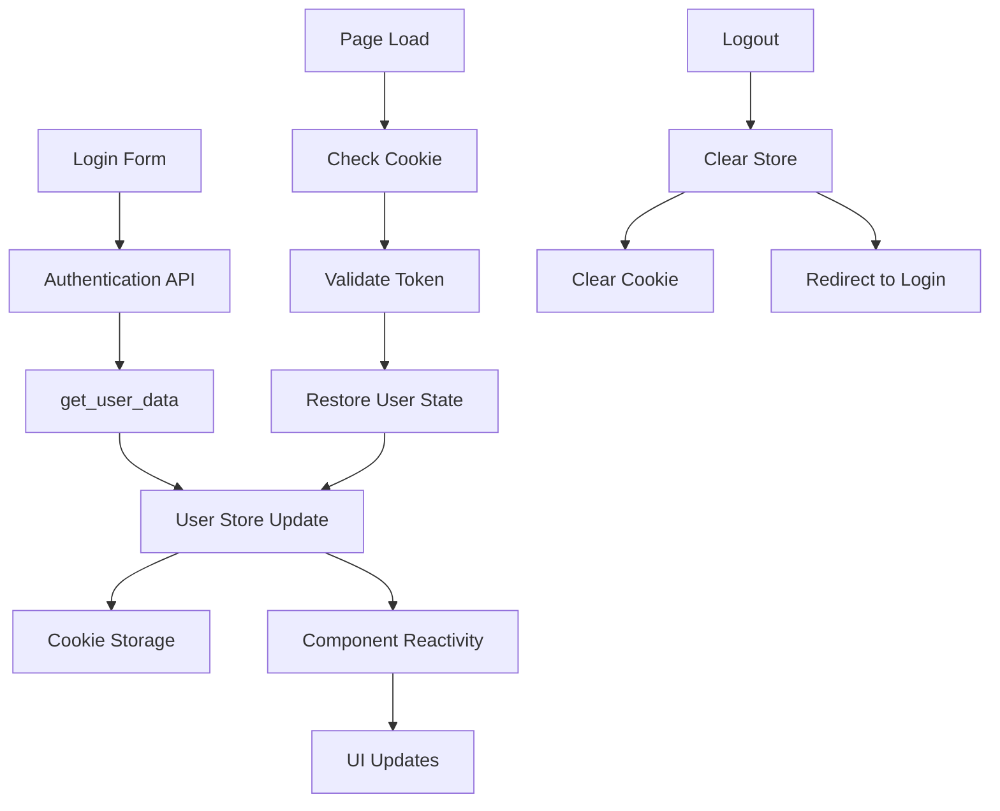

# User Store and Authentication System

## Overview

The user store is a centralized state management system that handles user authentication, session management, and user data persistence throughout the application. It provides a reactive way to manage user information and authentication state using Svelte's built-in store system.

## Architecture

### Store Structure

```
User Store System:
├── src/lib/stores/userStore.ts # Main user store definition
├── src/lib/auth.ts             # Authentication utilities
├── src/components/auth/        # Auth UI Components
│   ├── login.svelte            # Login component
│   ├── signup.svelte           # Registration component
│   └── profile.svelte          # User profile management
└── src/utils/authentication/   # Auth utility components
    ├── SignIn.svelte
    ├── SignUp.svelte
    └── ...
```

### Data Flow



## User Store Interface

### User Data Structure

```typescript
// src/lib/stores/userStore.ts
export interface User {
    id: string;                          // Unique user identifier
    name: string;                        // User's display name
    email: string;                       // User's email address
    url_base: string | undefined;        // API base URL
    token: string | undefined;           // JWT authentication token
    allowed_apps: string[] | undefined;  // Permitted applications
    tokens_left: number;                 // Remaining API tokens
    tokens_allocated: number;            // Total allocated tokens
}

// Writable store instance
export const userStore = writable<User | null>(null);
```

### Store Operations

```typescript
import { userStore, type User } from '$lib/stores/userStore';

// Subscribe to user changes
userStore.subscribe((user) => {
    if (user) {
        console.log(`User ${user.name} is logged in`);
    } else {
        console.log('No user logged in');
    }
});

// Set user data (typically after login)
const userData: User = {
    id: '123',
    name: 'John Doe',
    email: 'john@example.com',
    url_base: 'https://api.example.com',
    token: 'jwt-token-here',
    allowed_apps: ['Profile', 'Home', 'AgentBuilder'],
    tokens_left: 950,
    tokens_allocated: 1000
};
userStore.set(userData);

// Update specific user properties
userStore.update((currentUser) => {
    if (currentUser) {
        return {
            ...currentUser,
            tokens_left: currentUser.tokens_left - 10
        };
    }
    return currentUser;
});

// Clear user data (logout)
userStore.set(null);

// Get current user value (non-reactive)
import { get } from 'svelte/store';
const currentUser = get(userStore);
```

## Authentication Process

### Login Flow

The login process involves multiple steps to ensure secure authentication and proper user data management:

```typescript
// From login.svelte - Simplified authentication flow
async function login(email: string, password: string) {
    try {
        // 1. Send credentials to authentication endpoint
        const formData = new FormData();
        formData.append('email', email);
        formData.append('password', password);

        const authResponse = await fetch(`${url_base}/login`, {
            method: "POST",
            body: formData,
        });

        if (!authResponse.ok) {
            throw new Error("Authentication failed");
        }

        const authData = await authResponse.json();
        
        if (!authData.login) {
            throw new Error("Invalid credentials");
        }

        // 2. Extract and store authentication token
        const token = authData.access_token;
        
        // Store token in HTTP-only cookie for security
        document.cookie = `access_token=${token}; path=/; max-age=86400; secure; samesite=strict`;

        // 3. Fetch complete user profile data
        const userProfile = await get_user_data(token, url_base);
        
        if (!userProfile) {
            throw new Error("Failed to fetch user profile");
        }

        // 4. Create user object for store
        const userObject: User = {
            id: userProfile.id,
            name: userProfile.name,
            email: userProfile.email,
            url_base: url_base,
            token: token,
            allowed_apps: userProfile.allowed_apps,
            tokens_left: userProfile.tokens_left,
            tokens_allocated: userProfile.tokens_allocated,
        };

        // 5. Update global user store
        userStore.set(userObject);

        // 6. Handle navigation and cleanup
        const navigateTo = returnPath || "/";
        sessionStorage.removeItem("returnTo");
        goto(navigateTo);

    } catch (error) {
        console.error("Login error:", error);
        // Handle error state
        errors = true;
        message = "Authentication failed. Please try again.";
    }
}
```

### User Data Fetching

The `get_user_data` function handles secure retrieval of user profile information:

```typescript
// src/lib/auth.ts
export async function get_user_data(token: string | undefined, url_base: string) {
    // Input validation
    if (!token || !url_base) {
        console.error("Missing token or URL base");
        return undefined;
    }

    try {
        // Make authenticated API request
        const res = await fetch(`${url_base}/info`, {
            method: "GET",
            headers: {
                "Content-Type": "application/json",
                "Authorization": `Bearer ${token}`,
            },
        });

        // Handle authentication errors
        if (!res.ok) {
            if (res.status === 401) {
                console.error("Unauthorized access - token may be expired");
                return undefined;
            }
            throw new Error(`HTTP error! status: ${res.status}`);
        }

        const response = await res.json();

        // Validate response structure
        if (!response || !response.id || !response.username || !response.email) {
            console.error("Invalid user data received from server");
            return undefined;
        }

        // Transform API response to application format
        return {
            id: response.id,
            name: response.username,
            email: response.email,
            allowed_apps: response.user_permissions 
                ? [...response.user_permissions, "Profile", "Home"] 
                : ["Profile", "Home"],
            tokens_left: response.tokens_used || 0,
            tokens_allocated: response.tokens_allocated || 0,
        };
        
    } catch (error) {
        console.error("Error fetching user data:", error);
        return undefined;
    }
}
```

## Session Management

### Cookie-Based Token Storage

The application uses HTTP cookies for secure token storage:

```typescript
// Setting authentication cookie
document.cookie = `access_token=${token}; path=/; max-age=86400; secure; samesite=strict`;

// Cookie attributes explained:
// - path=/: Available across entire application
// - max-age=86400: Expires after 24 hours (86400 seconds)
// - secure: Only sent over HTTPS in production
// - samesite=strict: CSRF protection
```

### Session Persistence

```typescript
// Check for existing session on app initialization
import { browser } from '$app/environment';
import { userStore } from '$lib/stores/userStore';

if (browser) {
    // Extract token from cookie
    const cookies = document.cookie.split(';');
    const tokenCookie = cookies.find(cookie => 
        cookie.trim().startsWith('access_token=')
    );
    
    if (tokenCookie) {
        const token = tokenCookie.split('=')[1];
        
        // Validate token and restore user session
        restoreUserSession(token);
    }
}

async function restoreUserSession(token: string) {
    try {
        const userProfile = await get_user_data(token, import.meta.env.VITE_DEV_URL);
        
        if (userProfile) {
            const userObject: User = {
                id: userProfile.id,
                name: userProfile.name,
                email: userProfile.email,
                url_base: import.meta.env.VITE_DEV_URL,
                token: token,
                allowed_apps: userProfile.allowed_apps,
                tokens_left: userProfile.tokens_left,
                tokens_allocated: userProfile.tokens_allocated,
            };
            
            userStore.set(userObject);
        }
    } catch (error) {
        console.error("Failed to restore user session:", error);
        // Clear invalid token
        document.cookie = 'access_token=; path=/; max-age=0';
    }
}
```

### Return Path Management

The application maintains user navigation context during authentication:

```typescript
// Store intended destination before redirecting to login
sessionStorage.setItem("returnTo", window.location.pathname);

// Restore intended destination after successful login
onMount(() => {
    if (browser) {
        const storedPath = sessionStorage.getItem("returnTo");
        if (storedPath) {
            returnPath = storedPath;
        }
    }
});

// Navigate to original destination after login
const navigateTo = returnPath || "/";
sessionStorage.removeItem("returnTo");
goto(navigateTo);
```

## Store Usage in Components

### Reactive User Display

```svelte
<!-- Component that reacts to user store changes -->
<script lang="ts">
    import { userStore } from '$lib/stores/userStore';
    
    // Reactive statement - automatically updates when store changes
    $: user = $userStore;
    
    // Or direct subscription
    let user;
    userStore.subscribe(value => {
        user = value;
    });
</script>

{#if user}
    <div class="user-info">
        <h2>Welcome, {user.name}!</h2>
        <p>Email: {user.email}</p>
        <p>Tokens remaining: {user.tokens_left} / {user.tokens_allocated}</p>
        
        <div class="allowed-apps">
            <h3>Available Applications:</h3>
            <ul>
                {#each user.allowed_apps || [] as app}
                    <li>{app}</li>
                {/each}
            </ul>
        </div>
    </div>
{:else}
    <div class="login-prompt">
        <p>Please log in to access this content.</p>
        <a href="/auth/login">Login</a>
    </div>
{/if}
```

### Authentication Guards

```typescript
// Route protection based on user store
import { userStore } from '$lib/stores/userStore';
import { goto } from '$app/navigation';
import { get } from 'svelte/store';

export function requireAuth() {
    const user = get(userStore);
    
    if (!user || !user.token) {
        // Store current path for return after login
        sessionStorage.setItem("returnTo", window.location.pathname);
        goto('/auth/login');
        return false;
    }
    
    return true;
}

// Application-specific permissions
export function requireApp(appName: string) {
    const user = get(userStore);
    
    if (!user) {
        goto('/auth/login');
        return false;
    }
    
    if (!user.allowed_apps?.includes(appName)) {
        goto('/unauthorized');
        return false;
    }
    
    return true;
}
```

### Token Management

```typescript
// Token usage tracking
function consumeTokens(amount: number) {
    userStore.update(user => {
        if (user && user.tokens_left >= amount) {
            return {
                ...user,
                tokens_left: user.tokens_left - amount
            };
        }
        return user;
    });
}

// Token validation and refresh
async function validateToken(token: string): Promise<boolean> {
    try {
        const response = await fetch(`${import.meta.env.VITE_DEV_URL}/validate`, {
            headers: {
                'Authorization': `Bearer ${token}`
            }
        });
        
        return response.ok;
    } catch {
        return false;
    }
}

// Automatic token refresh
userStore.subscribe(async (user) => {
    if (user?.token) {
        const isValid = await validateToken(user.token);
        
        if (!isValid) {
            // Token expired, redirect to login
            userStore.set(null);
            document.cookie = 'access_token=; path=/; max-age=0';
            goto('/auth/login');
        }
    }
});
```

## Advanced Store Patterns

### Derived Stores

```typescript
import { derived } from 'svelte/store';
import { userStore } from '$lib/stores/userStore';

// Derived store for authentication status
export const isAuthenticated = derived(
    userStore,
    ($user) => $user !== null && !!$user.token
);

// Derived store for user permissions
export const userPermissions = derived(
    userStore,
    ($user) => $user?.allowed_apps || []
);

// Derived store for token usage percentage
export const tokenUsagePercentage = derived(
    userStore,
    ($user) => {
        if (!$user || !$user.tokens_allocated) return 0;
        const used = $user.tokens_allocated - $user.tokens_left;
        return (used / $user.tokens_allocated) * 100;
    }
);
```

### Custom User Store Extensions

```typescript
// Extended user store with additional methods
function createUserStore() {
    const { subscribe, set, update } = writable<User | null>(null);
    
    return {
        subscribe,
        set,
        update,
        
        // Login method
        login: async (email: string, password: string) => {
            // Implementation from login component
        },
        
        // Logout method
        logout: () => {
            set(null);
            document.cookie = 'access_token=; path=/; max-age=0';
            sessionStorage.removeItem("returnTo");
            goto('/auth/login');
        },
        
        // Update user profile
        updateProfile: async (profileData: Partial<User>) => {
            update(user => user ? { ...user, ...profileData } : null);
        },
        
        // Consume tokens
        consumeTokens: (amount: number) => {
            update(user => {
                if (user && user.tokens_left >= amount) {
                    return { ...user, tokens_left: user.tokens_left - amount };
                }
                return user;
            });
        },
        
        // Check permission
        hasPermission: (appName: string): boolean => {
            const user = get({ subscribe });
            return user?.allowed_apps?.includes(appName) || false;
        }
    };
}

export const userStore = createUserStore();
```

## Security Considerations

### Token Security

1. **HTTP-Only Cookies**: Tokens are stored in HTTP-only cookies to prevent XSS attacks
2. **Secure Transmission**: Cookies are marked `secure` in production
3. **CSRF Protection**: `samesite=strict` attribute prevents CSRF attacks
4. **Token Expiration**: Tokens expire after 24 hours for security

### Data Validation

```typescript
// Validate user data before storing
function validateUserData(userData: any): userData is User {
    return (
        typeof userData.id === 'string' &&
        typeof userData.name === 'string' &&
        typeof userData.email === 'string' &&
        Array.isArray(userData.allowed_apps) &&
        typeof userData.tokens_left === 'number' &&
        typeof userData.tokens_allocated === 'number'
    );
}

// Safe user store update
function safeSetUser(userData: any) {
    if (validateUserData(userData)) {
        userStore.set(userData);
    } else {
        console.error('Invalid user data received');
        userStore.set(null);
    }
}
```

### Session Security

```typescript
// Secure session restoration
async function restoreSecureSession() {
    try {
        const token = getTokenFromCookie();
        
        if (!token) return;
        
        // Validate token with server
        const isValid = await validateToken(token);
        
        if (!isValid) {
            clearSession();
            return;
        }
        
        // Fetch fresh user data
        const userData = await get_user_data(token, import.meta.env.VITE_DEV_URL);
        
        if (userData && validateUserData(userData)) {
            userStore.set({
                ...userData,
                token,
                url_base: import.meta.env.VITE_DEV_URL
            });
        }
        
    } catch (error) {
        console.error('Session restoration failed:', error);
        clearSession();
    }
}

function clearSession() {
    userStore.set(null);
    document.cookie = 'access_token=; path=/; max-age=0';
    sessionStorage.clear();
}
```

## Error Handling

### Authentication Errors

```typescript
// Centralized error handling for authentication
export class AuthError extends Error {
    constructor(
        message: string,
        public code: string,
        public statusCode?: number
    ) {
        super(message);
        this.name = 'AuthError';
    }
}

// Error types
export const AUTH_ERRORS = {
    INVALID_CREDENTIALS: 'INVALID_CREDENTIALS',
    TOKEN_EXPIRED: 'TOKEN_EXPIRED',
    NETWORK_ERROR: 'NETWORK_ERROR',
    INSUFFICIENT_PERMISSIONS: 'INSUFFICIENT_PERMISSIONS'
} as const;

// Error handling in store operations
async function handleAuthError(error: any) {
    if (error instanceof AuthError) {
        switch (error.code) {
            case AUTH_ERRORS.TOKEN_EXPIRED:
                userStore.set(null);
                goto('/auth/login');
                break;
            case AUTH_ERRORS.INSUFFICIENT_PERMISSIONS:
                goto('/unauthorized');
                break;
            default:
                console.error('Authentication error:', error.message);
        }
    }
}
```

## Testing the User Store

### Unit Tests

```typescript
// userStore.test.ts
import { describe, it, expect, beforeEach } from 'vitest';
import { get } from 'svelte/store';
import { userStore, type User } from '$lib/stores/userStore';

describe('User Store', () => {
    beforeEach(() => {
        userStore.set(null);
    });

    it('should initialize with null user', () => {
        const user = get(userStore);
        expect(user).toBeNull();
    });

    it('should set user data correctly', () => {
        const userData: User = {
            id: '123',
            name: 'Test User',
            email: 'test@example.com',
            url_base: 'https://api.test.com',
            token: 'test-token',
            allowed_apps: ['Profile', 'Home'],
            tokens_left: 100,
            tokens_allocated: 1000
        };

        userStore.set(userData);
        const user = get(userStore);
        
        expect(user).toEqual(userData);
    });

    it('should update user tokens correctly', () => {
        const userData: User = {
            id: '123',
            name: 'Test User',
            email: 'test@example.com',
            url_base: 'https://api.test.com',
            token: 'test-token',
            allowed_apps: ['Profile'],
            tokens_left: 100,
            tokens_allocated: 1000
        };

        userStore.set(userData);
        
        userStore.update(user => {
            if (user) {
                return { ...user, tokens_left: user.tokens_left - 10 };
            }
            return user;
        });

        const updatedUser = get(userStore);
        expect(updatedUser?.tokens_left).toBe(90);
    });

    it('should clear user data on logout', () => {
        const userData: User = {
            id: '123',
            name: 'Test User',
            email: 'test@example.com',
            url_base: 'https://api.test.com',
            token: 'test-token',
            allowed_apps: ['Profile'],
            tokens_left: 100,
            tokens_allocated: 1000
        };

        userStore.set(userData);
        expect(get(userStore)).not.toBeNull();

        userStore.set(null);
        expect(get(userStore)).toBeNull();
    });
});
```

### Integration Tests

```typescript
// auth.integration.test.ts
import { describe, it, expect, vi } from 'vitest';
import { render, fireEvent, waitFor } from '@testing-library/svelte';
import { get } from 'svelte/store';
import LoginComponent from '$lib/components/auth/login.svelte';
import { userStore } from '$lib/stores/userStore';

describe('Authentication Integration', () => {
    it('should update user store after successful login', async () => {
        // Mock successful login API response
        global.fetch = vi.fn()
            .mockResolvedValueOnce({
                ok: true,
                json: () => Promise.resolve({
                    login: true,
                    access_token: 'test-token'
                })
            })
            .mockResolvedValueOnce({
                ok: true,
                json: () => Promise.resolve({
                    id: '123',
                    username: 'Test User',
                    email: 'test@example.com',
                    user_permissions: ['Profile', 'Home'],
                    tokens_used: 50,
                    tokens_allocated: 1000
                })
            });

        const { getByPlaceholderText, getByText } = render(LoginComponent);
        
        // Fill in login form
        await fireEvent.input(getByPlaceholderText('Email'), {
            target: { value: 'test@example.com' }
        });
        await fireEvent.input(getByPlaceholderText('Password'), {
            target: { value: 'password123' }
        });
        
        // Submit form
        await fireEvent.click(getByText('Log In'));
        
        // Wait for store to be updated
        await waitFor(() => {
            const user = get(userStore);
            expect(user).not.toBeNull();
            expect(user?.email).toBe('test@example.com');
            expect(user?.tokens_left).toBe(50);
        });
    });
});
```

## Best Practices

### Store Management

1. **Single Source of Truth**: Keep user data centralized in the store
2. **Reactive Updates**: Use reactive statements for UI updates
3. **Immutable Updates**: Always create new objects when updating
4. **Error Boundaries**: Handle authentication errors gracefully
5. **Type Safety**: Use TypeScript interfaces for user data

### Security Best Practices

1. **Token Validation**: Regularly validate tokens with the server
2. **Secure Storage**: Use HTTP-only cookies for token storage
3. **Permission Checks**: Validate permissions before accessing resources
4. **Session Timeout**: Implement automatic session expiration
5. **Data Sanitization**: Validate all user data before storing

### Performance Optimization

1. **Lazy Loading**: Load user data only when needed
2. **Caching**: Cache user permissions and app access
3. **Debouncing**: Debounce frequent store updates
4. **Memory Management**: Clean up subscriptions properly
5. **Efficient Updates**: Use targeted updates instead of full replacements

## Migration and Compatibility

### Upgrading User Store

```typescript
// Version migration for user store
const USER_STORE_VERSION = 2;

interface UserV1 {
    id: string;
    name: string;
    email: string;
}

interface UserV2 extends UserV1 {
    url_base: string;
    token: string;
    allowed_apps: string[];
    tokens_left: number;
    tokens_allocated: number;
}

function migrateUserData(userData: any): User | null {
    if (!userData) return null;
    
    // Handle version 1 to version 2 migration
    if (!userData.version || userData.version < 2) {
        return {
            ...userData,
            url_base: import.meta.env.VITE_DEV_URL,
            allowed_apps: userData.allowed_apps || ['Profile', 'Home'],
            tokens_left: userData.tokens_left || 0,
            tokens_allocated: userData.tokens_allocated || 1000
        };
    }
    
    return userData;
}
```

## See Also

- [Authentication Components](components/README.md#authentication-components) - UI components for auth
- [API Reference](api-reference.md#authentication-api) - Authentication API documentation
- [Development Guide](development.md) - Development setup and patterns
- [Testing Guide](testing.md) - Testing authentication flows
- [Security Guide](security.md) - Security best practices
